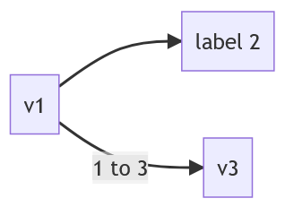
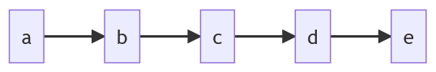

# DG

<!-- DOC -->

Elixir wrapper of `digraph` with a pinch of protocols

## Highlights

### Inspect

```elixir
dg = DG.new()
DG.add_vertex(dg, "v1")
DG.add_vertex(dg, "v2", "label 2")
DG.add_vertex(dg, "v3")
DG.add_edge(dg, "v1", "v2")
DG.add_edge(dg, "v1", "v3", "1 to 3")

IO.inspect(dg)
```

Outputs `mermaid.js` format flowchart

```
graph LR
    v1-->v2[label 2]
    v1--1 to 3-->v3
```

which can be put into livebook `mermaid` block and will display as



### Collectable

Easily add

- vertices `[{:vertex, 1}, {:vertex, 2, "label 2"}, ...]`
- or edges `[{:edge, 1, 2}, {:edge, "a", "b", "label ab"}, ...]`

to the graph via `Enum.into/2`

```elixir
dg = DG.new()

~w(a b c d e) |> Enum.map(&{:vertex, &1}) |> Enum.into(dg)

~w(a b c d e)
|> Enum.chunk_every(2, 1, :discard)
|> Enum.map(fn [f, t] -> {:edge, f, t} end)
|> Enum.into(dg)

IO.inspect(dg)
```

outputs

```
graph LR
    b-->c
    c-->d
    a-->b
    d-->e
```



## Installation

If [available in Hex](https://hex.pm/docs/publish), the package can be installed
by adding `dg` to your list of dependencies in `mix.exs`:

```elixir
def deps do
  [
    {:dg, "~> 0.1.0"}
  ]
end
```

Documentation can be generated with [ExDoc](https://github.com/elixir-lang/ex_doc)
and published on [HexDocs](https://hexdocs.pm). Once published, the docs can
be found at <https://hexdocs.pm/dg>.
