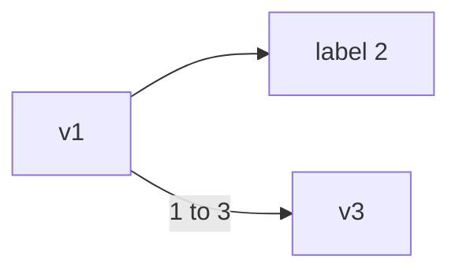
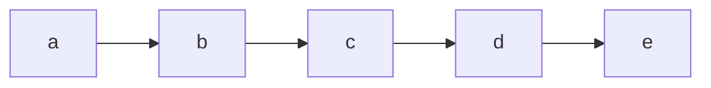

# DG

<!-- DOC -->

Elixir wrapper of `:digraph` with a pinch of protocols and sigils

## Installation

The package can be installed by adding `dg` to your list of dependencies in `mix.exs`:

```elixir
def deps do
  [
    {:dg, "~> 0.4"},
    ...
  ]
end
```

## Highlights

### Inspect

```elixir
dg = DG.new()
DG.add_vertex(dg, "v1")
DG.add_vertex(dg, "v2", "label 2")
DG.add_vertex(dg, "v3")
DG.add_edge(dg, "v1", "v2")
DG.add_edge(dg, "v1", "v3", "1 to 3")

IO.inspect(dg)
```

Outputs `mermaid.js` format flowchart

```
graph LR
    v1-->v2[label 2]
    v1--1 to 3-->v3
```

which can be put into livebook `mermaid` block and will display as



### Collectable

Easily add

- vertices `[{:vertex, 1}, {:vertex, 2, "label 2"}, ...]`
- or edges `[{:edge, 1, 2}, {:edge, "a", "b", "label ab"}, ...]`

to the graph via `Enum.into/2`

```elixir
dg = DG.new()

~w(a b c d e) |> Enum.map(&{:vertex, &1}) |> Enum.into(dg)

~w(a b c d e)
|> Enum.chunk_every(2, 1, :discard)
|> Enum.map(fn [f, t] -> {:edge, f, t} end)
|> Enum.into(dg)

IO.inspect(dg)
```

outputs



### Functions

- Most functions from `:digraph` and `:digraph_utils` are mirrored under `DG`.
- Some functions have their parameters re-arranged so that the graph is always the first parameter.
  (namely `reachable/2`, `reachable_neighbours/2`, `reaching/2` and `reaching_neighbours/2`)
- `new/{0,1,2,3}` returns `%DG{}` instead of an Erlang `digraph`
- `new/2` and `new/3` are shortcuts that can add vertices and edges on creation,
  which don't exist on `:digraph`

### Sigils

`~G` and `~g` are provided so you can copy `mermaid.js` flowchart and paste into Elixir to get a `%DG{}`

```elixir
import DG.Sigil

dg = ~G"""
graph LR
  a[some label]
  b[other label]
  1-->2
  3[three] -- three to four --> 4[four]
  a --> b
"""
```

```elixir
# With interpolation

label = "1 2 3"
dg = ~g"""
graph LR
  a --#{label}--> b
"""
```

**caveat:** `:digraph` is stateful (using `ets`), don't use the sigil at compile time,
e.g. as a module attribute, it won't carry over to runtime.
Only use it in runtime code, e.g. function body,
and remember to clean up properly when it's no longer used, with `delete/1`.

### Load from `libgraph`

```elixir
dg = DG.new()
DG.from({:libgraph, graph})
```
